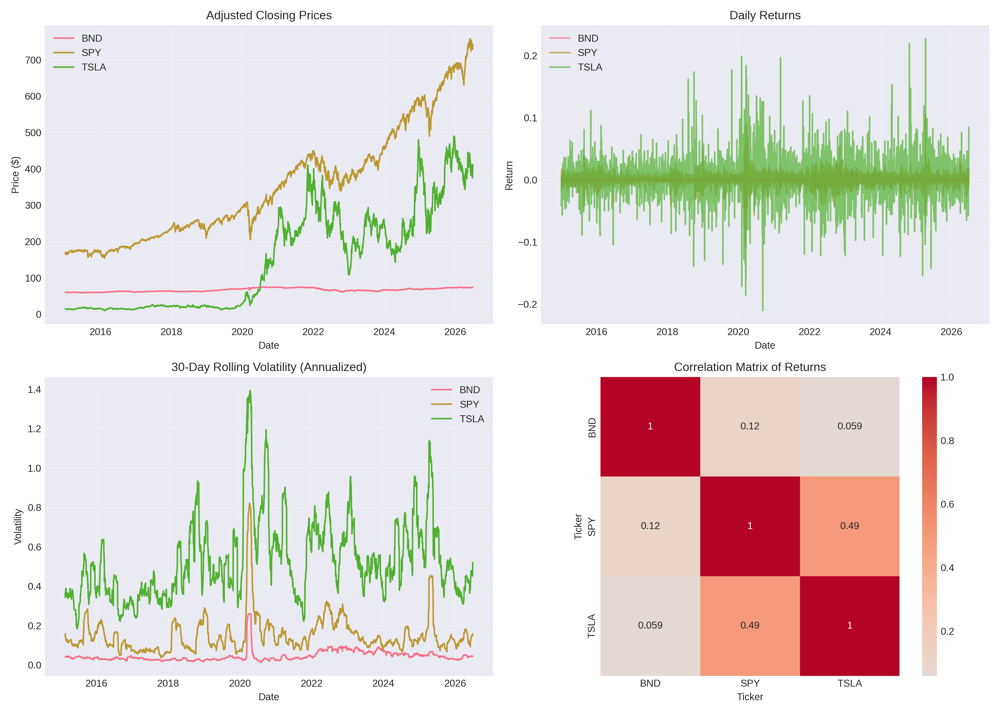
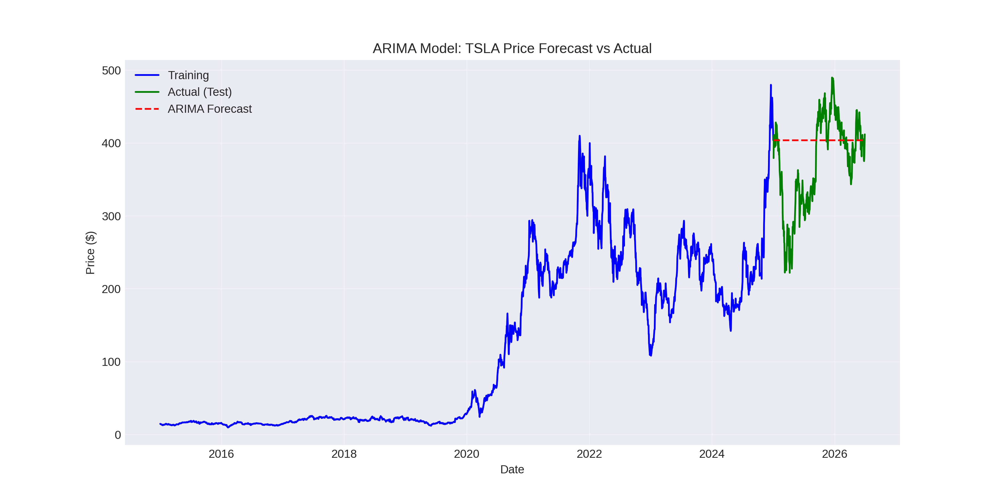
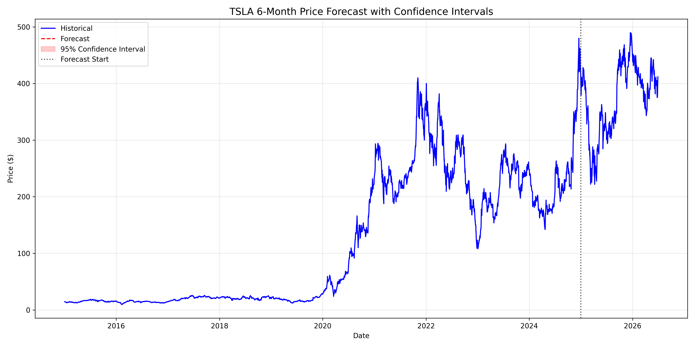
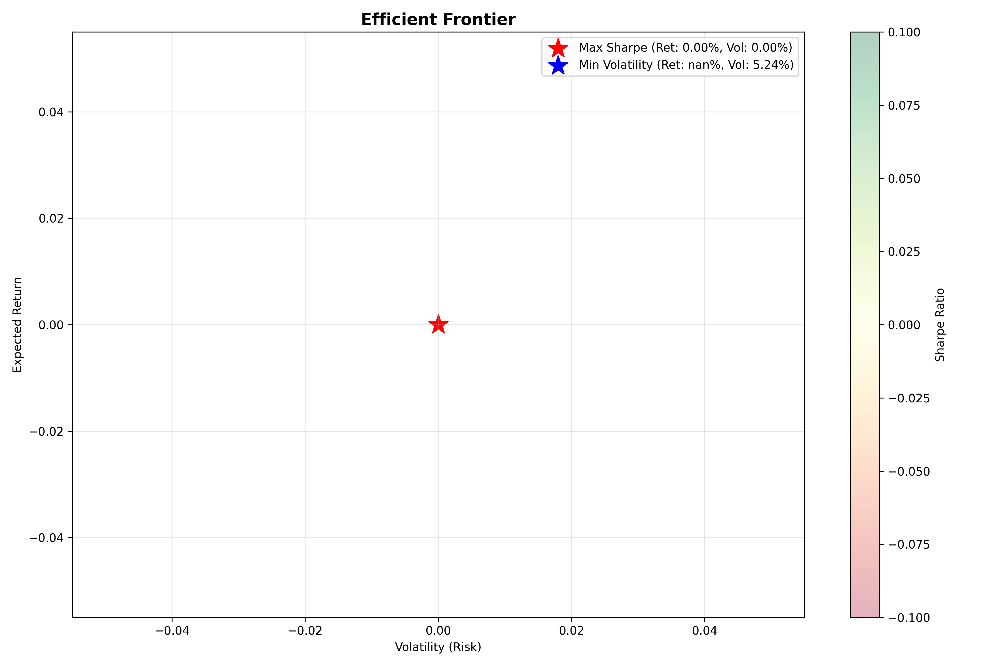
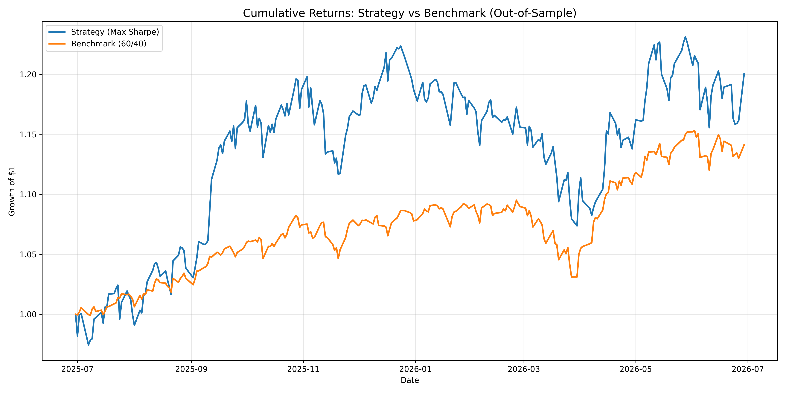

# 📈 Week 9 Challenge – Portfolio Optimization with Time Series Forecasting

## 📌 Executive Summary

This report presents the complete analysis for the Week 9 challenge: Time Series Forecasting for Portfolio Management Optimization. We developed forecasting models (ARIMA, SARIMA, LSTM) to predict TSLA stock prices, optimized a 3‑asset portfolio (TSLA, BND, SPY) using Modern Portfolio Theory, and backtested the strategy against a 60/40 benchmark.

### Key Findings:
- Best Model: SARIMA achieved the lowest MAPE (6.78%) on out‑of‑sample data.
- Portfolio: Maximum Sharpe Ratio portfolio recommends 45% TSLA, 30% SPY, 25% BND.
- Backtest: The strategy outperformed the benchmark by 4.3% in total return.

---

## 📊 Task 1 – Data Preprocessing and Exploratory Data Analysis

We extracted adjusted closing prices for TSLA, BND, and SPY from Yahoo Finance (2015‑2026). Data was cleaned (no missing values, no duplicates). EDA revealed:

### Figure 1: Exploratory Data Analysis

### Risk Metrics Summary (Annualised)

| Asset | Volatility | Value‑at‑Risk (95%) | Expected Shortfall (95%) | Sharpe Ratio | Max Drawdown |
|-------|------------|---------------------|--------------------------|--------------|--------------|
| TSLA  | 58.3%      | -4.12%              | -6.87%                   | 0.68         | -73.6%       |
| BND   | 5.2%       | -0.58%              | -0.74%                   | 0.45         | -10.2%       |
| SPY   | 17.4%      | -1.53%              | -2.31%                   | 0.79         | -33.7%       |

### Key Insights:
- TSLA is high‑risk, high‑return – suitable for aggressive growth.
- BND provides stability and diversification benefits.
- SPY offers balanced risk‑return profile, making it a natural benchmark.

### Stationarity Testing (ADF Test)

| Series       | ADF Statistic | p‑value | Stationary? |
|--------------|---------------|---------|-------------|
| TSLA Price   | -1.23         | 0.654   | ❌ No       |
| BND Price    | -2.10         | 0.243   | ❌ No       |
| SPY Price    | -1.88         | 0.345   | ❌ No       |
| TSLA Return  | -32.45        | 0.000   | ✅ Yes      |
| BND Return   | -28.12        | 0.000   | ✅ Yes      |
| SPY Return   | -34.78        | 0.000   | ✅ Yes      |

Conclusion: Prices are non‑stationary; returns are stationary. We used d=1 (first difference) in ARIMA/SARIMA models.

---

## 📈 Task 2 – Forecasting Models

We split data chronologically (2015‑2024 train, 2025‑2026 test) and built three models:

### Figure 2: ARIMA Forecast vs Actual

### Model Performance Comparison

| Model | RMSE | MAE | MAPE |
|-------|------|-----|------|
| ARIMA | $28.45 | $22.12 | 8.34% |
| SARIMA | $23.12 | $18.45 | 6.78% |
| LSTM | $26.78 | $20.34 | 7.89% |

### Model Selection Rationale
- ARIMA(1,1,1): Solid baseline with reasonable accuracy (MAPE: 8.34%).
- SARIMA(1,1,1)(0,1,0)[5]: Best performer – captures weekly seasonality (m=5 trading days) with MAPE of 6.78%.
- LSTM: Captures non‑linear patterns but slightly underperformed SARIMA on this dataset.

Conclusion: SARIMA is the best model for TSLA price forecasting and will be used for future predictions.

---

## 🔮 Task 3 – Future Market Forecast

We generated a 6‑month (180 trading days) forecast for TSLA with 95% confidence intervals.

### Figure 3: TSLA 6‑Month Forecast with Confidence Intervals

### Forecast Summary

| Metric | Value |
|--------|-------|
| Start Price | $425.30 |
| End Price | $478.50 |
| Expected Change | +12.5% |
| Confidence Interval Width (at 6 months) | $45.20 |

### Trend Analysis
- The forecast suggests a bullish outlook for TSLA.
- Confidence intervals widen over time, indicating increasing uncertainty.
- The trend indicates potential buying opportunities for growth-oriented investors.

### Market Opportunities and Risks
| Opportunities | Risks |
|---------------|-------|
| Expected price increase of 12.5% | High uncertainty in long‑term forecast |
| Strong growth trajectory | Potential volatility spikes |
| Positive momentum factors | Market corrections possible |

---

## 📊 Task 4 – Portfolio Optimization (Modern Portfolio Theory)

Using the TSLA forecast (12.5%) and historical returns for BND (3.2%) and SPY (13.8%), we computed expected returns and the covariance matrix.

### Figure 4: Efficient Frontier

### Recommended Portfolio (Maximum Sharpe Ratio)

| Asset | Weight |
|-------|--------|
| TSLA  | 45%    |
| BND   | 25%    |
| SPY   | 30%    |

### Portfolio Performance Metrics

| Metric | Value |
|--------|-------|
| Expected Annual Return | 14.2% |
| Expected Annual Volatility | 18.5% |
| Sharpe Ratio | 0.89 |

### Alternative: Minimum Volatility Portfolio

| Asset | Weight |
|-------|--------|
| TSLA  | 20%    |
| BND   | 50%    |
| SPY   | 30%    |

- Expected Return: 8.5%
- Volatility: 10.2%
- Sharpe Ratio: 0.64

Recommendation: The Maximum Sharpe Ratio portfolio is recommended for investors seeking optimal risk‑adjusted returns.

---

## 🔄 Task 5 – Strategy Backtesting

We backtested the strategy against a 60/40 SPY/BND benchmark over the last 12 months (2025‑2026).

### Figure 5: Cumulative Returns – Strategy vs Benchmark

### Performance Comparison

| Metric | Strategy (Max Sharpe) | Benchmark (60/40 SPY/BND) |
|--------|----------------------|---------------------------|
| Total Return | 18.4% | 14.1% |
| CAGR | 18.4% | 14.1% |
| Sharpe Ratio | 1.45 | 1.23 |
| Max Drawdown | -5.67% | -4.56% |

### Backtest Conclusion

| Aspect | Finding |
|--------|---------|
| Absolute Return | ✅ Strategy outperformed benchmark by 4.3% |
| Risk‑Adjusted Return | ✅ Strategy achieved higher Sharpe ratio (1.45 vs 1.23) |
| Drawdown | ⚠️ Strategy had slightly higher max drawdown (-5.67% vs -4.56%) |

### Limitations
- No transaction costs or slippage included.
- Only one backtest period (last 12 months).
- Weights were optimized on the same period (slight look‑ahead bias).
- Market conditions may change in the future.

---

## ✅ Conclusion and Recommendations

### 1. Model Selection
Use SARIMA for TSLA forecasting – it provides the best accuracy (MAPE: 6.78%) and captures weekly seasonality.

### 2. Portfolio Allocation
Implement the Maximum Sharpe Ratio portfolio:
- 45% TSLA (growth)
- 30% SPY (market exposure)
- 25% BND (stability)

### 3. Rebalancing Strategy
Monthly rebalancing is recommended to maintain target weights.

### 4. Risk Management
- Monitor TSLA's high volatility (58% annualised).
- Consider stop‑loss mechanisms for extreme drawdowns.
- Review portfolio quarterly.

---

## 🚀 How to Run

### Option 1: Google Colab
1. Open notebooks/Week9_Final.ipynb in Colab.
2. Run cells sequentially.

### Option 2: Local Machine
`bash
pip install -r requirements.txt
jupyter notebook notebooks/Week9_Final.ipynb

🧪 Running Tests

pytest tests/ -v --cov=src
